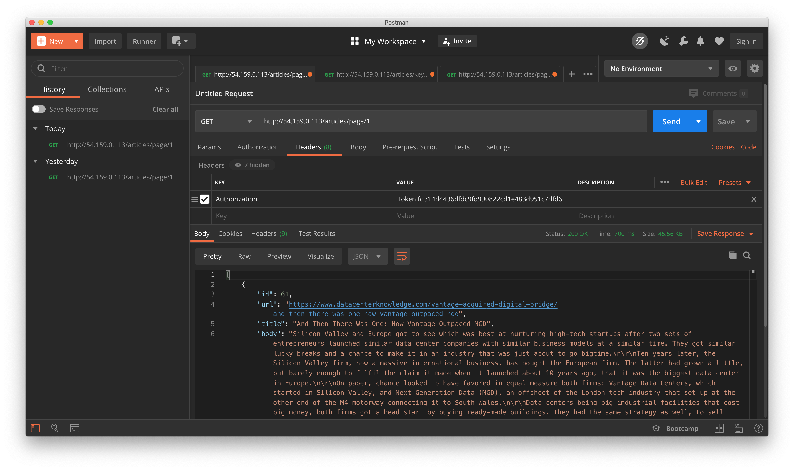

# Django Application that works as API and runs a CRON Job


## Project Structure : 

The complete Project is built by following standard Django Conventions. The app only contains the `api` which contains all the business logic serving the REST API.

- `api/views.py` contains the logic for the endpoints
- `api/models.py` contains the 'Article' Model definition. 
- `api/documents.py` contains models definition for ElasticSearch api indexing
- `derrick/urls.py` contains the valid endpoints and the patterns they follow.

## How to run

```
python manage.py runserver 0.0.0.0:80
```

## Admin Page
```
http://34.234.193.247/admin
username : derrick
password : derrick  
```



Endpoints that can be consumed by a frontend : 

### Get Articles by Page number

```
# Pattern
http://34.234.193.247/articles/page/<page_number>

# Example
http://34.234.193.247/articles/page/1
```

### Get Article by Searching for a keyword

```
# Pattern
http://34.234.193.247/articles/keyword/<keyword>/<max_number_of_results>

# Example
http://34.234.193.247/articles/keyword/Google/25
```

### Add this to the Request Headers when calling the GET Request. 

```
Key : "Authorization"
Value : "Token fd314d4436dfdc9fd990822cd1e483d951c7dfd6"

NOTE : You can find this token and create new ones from the Django Admin Dashboard. 
You can test it using Postman by adding the following key-value pair in Postman
```

## How to Crawl a New Site

- Make a copy of any existing folder in the directory `custom_crawlers`
- Rename the folder to the site you want to scrape, for example : `datacenterknowledge.com`
- Make necessary changes in the functionsin the `crawl_for_links.py` file. The changes should be minimal, depending on the structure of the new website. 
- Once, you've made the changes, run the script using the command `python crawl_for_links.py` and the script should start crawling and a new file named `article_links.txt` will be populated with links as the cralwers runs.
- Next, make necessary changes in the `scrape_article_page()` function in the file `scrape_article_body_and_save_to_db.py`.
- cd to the home directory of the app and run the Django Shell using the command `./manage.py shell`.
- Finally, we need to run the script which will scrape the contents of the links containing an article and will add the data to the DB. Type the following command within the Django shell to start running the script : `exec(open("custom_crawlers/<site_name>/scrape_article_body_and_save_to_db.py").read())`. Don't forget to replace `<site_name>` with the folder you created in the first step, for example : `networkworld`.
- You should be able to see the progress of the Script as it runs.

Reasons for designing such a structure : 

- All functions are modular i.e. they only perform one operation and the logic of the function can easily be modified without needed to alter the flow of the complete crawler.
- there is usually a fixed pattern followed whenever trying to create a crawler for a particular website, hence the given structure.
- Crawling for links first and then scraping allows more modularized code, hence easy to test and experiment with separately and their functionalities can be helpful for more different use cases.
- It also allows to crawl a site while respecting ROBOTS.txt
